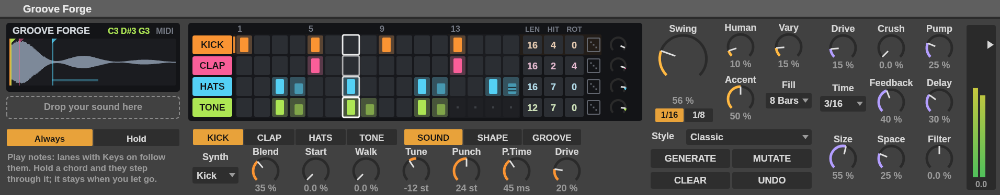
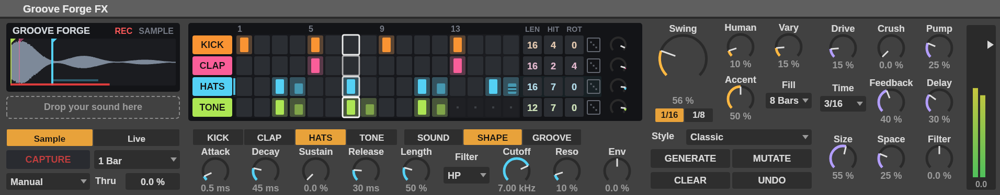

# Groove Forge

A Max for Live device that turns one sound into a techno groove.

Give it a sample, a sound captured off any track, or just the notes you play, and it
builds four lanes out of it — **kick, clap, hats and tone** — each playing your sound
through its own pitch, envelope and filter, over a synth voice that fills in whatever
your sound lacks. Swing, nudge, humanize, chance, rolls and fills make it move; drive,
crush, pump, delay, reverb and a DJ filter make it loud.



*A layout preview rendered from the build: the display is the device's own drawing code;
Live draws its own knobs and menus, so those will look like Live, not like this.*

---

## What is in this folder

| File | What it is |
|---|---|
| `Groove Forge.amxd` | **Max Instrument.** Goes on a MIDI track. Play it from your keyboard or a clip. |
| `Groove Forge FX.amxd` | **Max Audio Effect.** Goes on any track. Captures what the track plays and grooves it. |
| `groove-forge-ui.js` | The display and step grid. **Keep it in the same folder as the devices.** |

Everything else (`src/`, `test/`, `tools/`) is how the devices are made and checked.
You only need it to change them.

## Install

1. Copy this whole folder into your Live **User Library** (or anywhere, then add that
   folder to Live's browser with *Add Folder…* under **Places**).
2. Drag `Groove Forge.amxd` onto a MIDI track, or `Groove Forge FX.amxd` onto any
   audio track (or after an instrument).
3. Press play in Live.

Needs Live 11 or 12 with Max for Live (Suite, or Standard with the add-on).

**Keep `groove-forge-ui.js` next to the `.amxd` files.** The devices find it in their own
folder. If the grid shows up blank, that file is missing. To make a device a single
self-contained file — for sharing, or for *Collect All and Save* — open it in Max (the
Edit button on the device's title bar), click **Freeze Device** in the patcher's toolbar,
and save. Max then folds the script inside the `.amxd`.

## Quick start

**Instrument (`Groove Forge.amxd`)**

1. Press play in Live. You hear the default groove on the built-in synth voices.
2. Drag any audio file or clip onto **Drop your sound here**. Every lane is now built
   from it.
3. Play a note: the **TONE** lane follows it. Hold a chord and TONE steps through its
   notes; let go and the chord keeps playing until you play the next one.
4. Press **GENERATE** until the groove is close, then **MUTATE** to nudge it.
5. Turn **Swing**.

Switch **Play** from *Always* to *Hold* and the groove only runs while you hold a key.

**Audio Effect (`Groove Forge FX.amxd`)**

1. Put it on a track that is playing something: a synth, a vocal, a loop, a mic.
2. Press play in Live, then **CAPTURE**. On the next downbeat it records a bar of the
   track, switches **Source** to *Live*, and grooves what it heard.
3. Set **Auto Capture** to *Every 4* and it re-captures by itself: a groove that keeps
   following whatever you play into it.
4. **Thru** decides how much of the original track you still hear.

You can drop a sample on the FX device too; it then becomes the source.

---

## How one sound becomes four lanes

Each lane plays the same sound, shaped differently:

| Lane | Starts as | What makes it that |
|---|---|---|
| **KICK** | your sound an octave down, low-passed at 260 Hz | **Punch** sweeps the pitch down 24 semitones in 45 ms. That drop is what turns almost anything into a kick. Under it, a sine kick. |
| **CLAP** | your sound, band-passed at 1.4 kHz | three quick noise bursts and a tail, like a hand clap |
| **HATS** | your sound, high-passed at 7 kHz, very short | a bank of six square waves at 808 cymbal ratios, plus noise. **Walk** makes each step read a different slice |
| **TONE** | your sound at its own pitch, filter swept by its envelope | two detuned saws. **Keys** makes it follow your notes |

**Blend** sets your sound against the synth voice underneath it: 0% is all synth, 100%
all sample. Until a sample is loaded, every lane plays its synth voice alone, so the
device grooves from the moment it lands on a track.

**Start** picks where in your sound a lane begins — click the waveform to set it for the
selected lane, and each lane's start is marked there in its colour. **Walk** moves each
step further into the sound, so a lane slices it across the pattern.

Any lane can use any synth voice (**Synth**: Kick, Clap, Hat, Tone, Sub), so four lanes
of hats, or two basslines, are one menu away.

---

## The screen



### The display (left)

Your sound's waveform, with each lane's start marked in its colour and **Walk** shown as
a bar underneath. It shows the held chord on the Instrument, and **ARMED** / **REC** with
a progress bar while the FX device captures.

### The grid (middle)

Four lanes of 16 steps. The coloured button at the start of each row mutes and unmutes
the lane; the small knob at the end is its level.

| Do this | To get this |
|---|---|
| Click a step | on, then accent, then off |
| Shift-click | toggle an accent |
| Alt/Option-click | roll the step (x2, x3 or x4: set by **Roll**) |
| Cmd-click (Ctrl on Windows) | end the lane here: lanes can be 1 to 16 steps long, and run against each other |
| Drag across a row | paint the same step all the way |
| Drag **LEN**, **HIT**, **ROT** up or down | lane length; **HIT** and **ROT** write a Euclidean rhythm, keeping accents that still land |
| Click the die | rewrite just that lane, in the current **Style** |

Each hit **leans inside its step to show how far swing and nudge move it**, so you can
see the groove, not just the grid. Accents are tall, plain steps short, rolls
striped. The playhead is the white outline.

### The lane editor (below the grid)

Pick a lane (**KICK / CLAP / HATS / TONE**, or just click in its row) and a page:

| Page | Controls |
|---|---|
| **SOUND** | Synth, Blend, Start, Walk, Tune, Punch, P.Time, Drive |
| **SHAPE** | Attack, Decay, Sustain, Release (the ADSR), Length (how long a note is held, as a share of a step), Filter type, Cutoff, Reso, Env |
| **GROOVE** | Chance, Swing (this lane's share of it), Nudge, Roll, Keys, Pan, Send |

### GROOVE

| Control | What it does |
|---|---|
| **Swing** | MPC-style swing. 50% is straight; around 54–58% is the usual techno shuffle; 66% is a triplet feel; 75% the hardest lean |
| **1/16 · 1/8** | Swing the 16th notes, or the 8th notes (the 16ths between follow) |
| **Human** | Random timing (up to 12 ms late — the kick barely moves, it is the clock) and velocity |
| **Accent** | How much quieter plain steps are than accented ones |
| **Vary** | Ghost notes on empty steps and small velocity drift, so a loop keeps breathing |
| **Fill** | A fill in the last beat of every 4, 8 or 16 bars: the kick drops out, the clap builds, the hats roll, the tone jumps an octave |
| **Style** + **GENERATE** | Write a new groove: *Classic*, *Rolling*, *Minimal*, *Broken*, *Hypnotic* (lanes at odd lengths against each other) or *Chaos*. It is never the same twice, and it stays in its style |
| **MUTATE** | Change a few steps and accents. The kick keeps its four on the floor |
| **CLEAR** · **UNDO** | Empty the selected lane; step back through pattern edits |

### FX (right)

| Row | Controls |
|---|---|
| 1 | **Drive** (saturation), **Crush** (bits and rate), **Pump** (the kick ducks everything else) |
| 2 | Delay **Time** (1/16 to 1/2, dotted and triplet, locked to tempo), **Feedback**, **Delay** level |
| 3 | **Size** and **Space** (reverb), **Filter** (DJ filter: left is low-pass, right is high-pass) |

Each lane's **Send** decides how much of it reaches the delay and the reverb. The fader
on the far right is the output.

---

## How the timing works

It is all about the groove, so it is sample-accurate.

- **The clock is Live's transport.** A `phasor~ 1n @lock 1` ramp follows Live's bar
  position to the sample; the engine reads each step off that ramp, and stops when Live
  stops. Relocating while stopped fires nothing; restarting fires the downbeat.
- **Swing is exact.** At swing *S*, the second 16th of each pair starts at *S* of the
  8th instead of halfway. With 8th swing, the second 8th of each beat moves and the 16ths
  either side of it are placed evenly. The display draws the same arithmetic.
- **Per lane**, **Swing** sets how much of the global swing a lane follows (keep the hats
  swung and the tone straight), and **Nudge** moves the whole lane early or late by up to
  half a step.
- **Rolls divide the step they are in**, including a swung one, so a roll never spills
  into the next step.
- **Lane lengths** from 1 to 16 run against each other and line up again at the start
  of the transport.

It assumes 4/4.

## Tips

- **Anything becomes a kick** with Tune around −12 to −24, Punch 18–30 and a low-pass
  under 300 Hz. Raise Blend for more of your sound, lower it for more sine.
- **Vocals and pads make great hats**: set HATS Start into a breathy or noisy part and
  add Walk.
- **Hypnotic** + a long Delay Time + Size up = warehouse.
- **Pump** at 40–60% with the reverb up is the classic breathing sidechain.
- Every control can be mapped to a MIDI controller with Live's MIDI Map mode, including
  the lane buttons and **GENERATE**.

## Troubleshooting

| What you see | Why, and what to do |
|---|---|
| The grid is blank | `groove-forge-ui.js` is not in the device's folder. Put it back, or freeze the device |
| No sound | The groove follows Live's transport: press play. In *Hold*, hold a key. Check the lane buttons are lit |
| The TONE lane does not follow my keys | **Keys** (GROOVE page) is on for TONE only by default; turn it on for any lane |
| Capture records silence | Capture records the track the FX device is on, at that point in the chain. Put the device after the sound |

---

## Changing it

Nothing here is hand-edited in Max. Both devices are generated:

| File | Role |
|---|---|
| `src/spec.js` | every parameter: name, range, default, where its knob goes |
| `src/engine.genexpr` | the gen~ engine, as a template: lanes and voices are unrolled when built |
| `groove-forge-ui.js` | the display, grid and pattern brain (ES5: Max's jsui engine) |
| `src/build.js` | writes both `.amxd` files, after checking every cord and parameter |
| `src/amxd.js` | the `.amxd` container |

```sh
npm test            # engine, display and wiring: about 30 seconds
npm run build       # rewrite both .amxd files
npm run engine      # print the expanded gen~ code
```

The tests fail if the committed `.amxd` files are not exactly what the sources build,
so run `npm run build` after any change. Node 18 or later; no dependencies.

`tools/preview.js` redraws the preview images (`npm install --no-save @napi-rs/canvas`
first).

### What the tests prove, and what they cannot

Max does not run on Linux, where this was built, so the devices have not been opened in
Live yet. What is checked instead:

- **The engine** runs in a GenExpr virtual machine (`test/genexpr-vm.js`) that parses the
  exact code gen~ receives — and is stricter than gen~: block scoping, no History read
  after it is written, no functions or stateful operators. Steps are checked against the
  sample they should land on; swing, nudge, rolls, polymeter, chance, fills, the ADSR,
  the filters, delay timing, pump, capture and the output limit all have tests.
- **The display** runs in a stand-in for Max's jsui host whose drawing API only has the
  calls Max documents.
- **The wiring** runs in a message-passing simulation of the whole patch with the real
  display inside it: knobs reach the parameter they are named for, grid clicks reach the
  stored pattern and then gen~, the right knobs show for each lane and page, a stored set
  loads without the grid rewriting it.
- **The `.amxd` container** is byte-identical to a reference writer that was itself
  checked against devices exported by Max.

What only Live can confirm: that gen~ compiles the engine (watch the Max window the first
time), and how Live's own controls look at these sizes.
